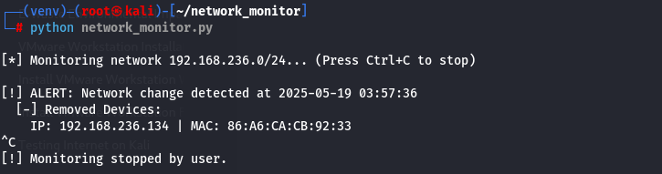

# 🔍 Network Security Monitor
**Easily detect unauthorized devices on your network using Python and Nmap**

---

## 🚀 Quick Start

bash
# 1. Install Nmap (if you don’t already have it)
sudo apt install nmap

# 2. Install the python-nmap module
pip3 install python-nmap

# 3. Run the network monitor
python3 network_monitor.py

---

## ✨ Features

- 🔔 Real-time alerts when new devices connect to your network  
- 🕒 Logs all device activity with timestamps  
- 🐱‍💻 Ready to go on Kali Linux with no extra setup  

---
## ⚙️ How It Works

1. **First Scan:**  
   It performs a full ping scan of your network and saves the result as the baseline.

2. **Continuous Monitoring:**  
   Every 60 seconds, it rescans your network and compares the new scan with the last known state.

3. **Instant Alerts:**  
   If the scan changes (e.g., a new device appears), it alerts you and logs the difference.

---

## 📁 Project Structure
## 📁 Project Structure

| File / Folder          | Purpose                              |
|------------------------|--------------------------------------|
| network_monitor.py   | The main monitoring script           |
| scan_logs/           | Stores timestamped scan results      |
| docs/                | Contains images like demo.png      |

---

## 🛠️ Configuration

Inside network_monitor.py, you can change the following:

python
NETWORK = "192.168.1.0/24"  # Your local subnet (run `ip a` to find yours)
SCAN_INTERVAL = 60          # Time in seconds between each scan

---

## 📸 Example Output

[!] ALERT: New device detected!
IP: 192.168.1.105 | MAC: ab:cd:ef:12:34:56

---

> 💡 **Pro Tip:** Use virtual machines to simulate new devices and safely test the alert system.

---

Stay secure — keep an eye on what’s joining your network! 🔐
